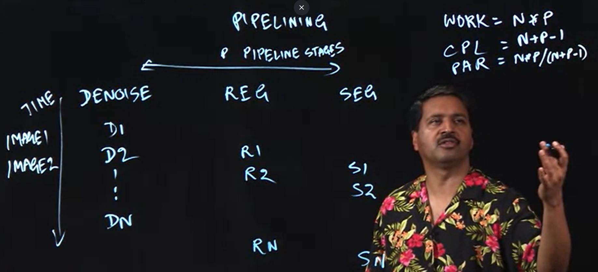
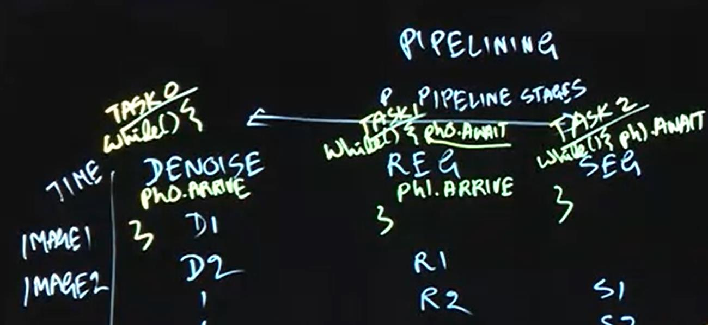

# Dataflow Synchronization and Pipelining


## Split-phase Barriers with Java Phasers
From [Loop parallelism](./LoopParallelism.md) we know that Barrier could be applied to seperate into two phases, and make sure second phase starts before first phase complete. While during the period of barrier, there are some operations could run in parallel with barrier. Thus, there comes the split-phase barrier.

### Split-phase Barrier(Fuzzy Barrier):  
```java
// initialize phaser ph	for use by n tasks ("parties") 
Phaser ph = new Phaser(n);

// split-phase barrier
int phase = ph.arriver();
/**
operations in parallel with the barrier processing 
*/
ph.awaitAdvance(phase);
```

### Application:
We observed that there are two possible positions for inserting a barrier between the two print statements below — before or after the call to lookup(i).
```java
forall (i : [0:n-1]) { 
  print HELLO, i;
  myId = lookup(i); // convert int to a string 
  print BYE, myId;
}
```
No specific need to either complete it before the barrier or to complete it after the barrier. In fact, the call to lookup(i) can be performed in parallel with the barrier. Thus, we could use split-phase barrier to run the lookup(i) in parallel with the barrier:
```java
// initialize phaser ph	for use by n tasks ("parties") 
Phaser ph = new Phaser(n);
// Create forall loop with n iterations that operate on ph 
forall (i : [0:n-1]) {
  print HELLO, i;
  int phase = ph.arrive();
  
  myId = lookup(i); // convert int to a string

  ph.awaitAdvance(phase);
  print BYE, myId;
}
```


## Point-to-Point Sychronization with Phaserss
The parameter 0 in awaitAdvance(0) represents a transition from phase 0 to phase 1
|    Taks0    |    Taks1    |     Taks2     |
|    :---:    |    :----:   |     :---:      |
| 1a:X=A();//cost=1      | 1b:Y=B();//cost=2       | 1c:Z=C();//cost=3   |
| 2a:ph0.arrive();   | 2b:ph1.arrive();        | 2c:ph2.arrive();      |
|  3a:ph1.awaitAdvance(0);  |   3b:ph0.awaitAdvance(0);  |  3c: ph1.awaitAdvance(0);|
|   4a:D(X,Y);//cost=3   |  4b:ph2.awaitAdvance(0);  |  4c:F(Y,Z);//cost=1   |   
|           |     5b:E(X,Y,Z);//cost=2      |           |
If we use barrier, the critical path would be 6 (1c + 4a).  
While if we use individual phasers as shown above, the critical path would be 5(1b + 4a or 5b+1c).


## One-Dimensional Iterative Averaging with Phasers
Barrier-based Iterative Averaging example could be improved by using phasers:
```java
// Allocate array of phasers
Phaser[] ph = new Phaser[n+2]; //array of phasers
for (int i = 0; i < ph.length; i++) ph[i] = new Phaser(1);

// Main computation 
forall ( i: [1:n-1]) {
  for (iter: [0:nsteps-1]) {
    newX[i] = (oldX[i-1] + oldX[i+1]) / 2;
    ph[i].arrive();
    
    if (index > 1) ph[i-1].awaitAdvance(iter);
    if (index < n-1) ph[i + 1].awaitAdvance(iter); 
    swap pointers newX and oldX;
  }
}
```

## Pipeline
one-dimensional pipeline with p tasks (stages), T0,...Tp  
Let n be the number of input items and p the number of stages in the pipeline, WORK = n × p is the total work that must be done for all data items, and CPL = n + p − 1 is the span or critical path length for the pipeline.  
Thus, the ideal parallelism is PAR = WORK /CPL = np / (n + p − 1)

After adding phasers to the pipeline, it should be like this:

And the code implementation should be like this:
```java
// Code for pipeline stage i
while ( there is an input to be processed ) {
  // wait for previous stage, if any 
  if (i > 0) ph[i - 1].awaitAdvance(); 
  
  process input;
  
  // signal next stage
  ph[i].arrive();
}
```


## Dataflow
**A → C, A → D, B → D, B → E**  
By including calls to A.get() and B.get() in task D, the computation graph edges are implicit in the get() calls when using futures. Instead, we introduced the asyncAwait notation to specify a task along with an explicit set of preconditions (events that the task must wait for before it can start execution)
```java
// The order of the above statements is not significant
async( () -> {/* Task A */; A.put(); } ); // Complete task and trigger event A
async( () -> {/* Task B */; B.put(); } ); // Complete task and trigger event B
asyncAwait(A, () -> {/* Task C */} );	    // Only execute task after event A is triggered 
asyncAwait(A, B, () -> {/* Task D */} );	  // Only execute task after events A, B are triggered 
asyncAwait(B, () -> {/* Task E */} );	    // Only execute task after event B is triggered
```
If the program omits a put() call for signalling an event, it may result in a "deadlock".